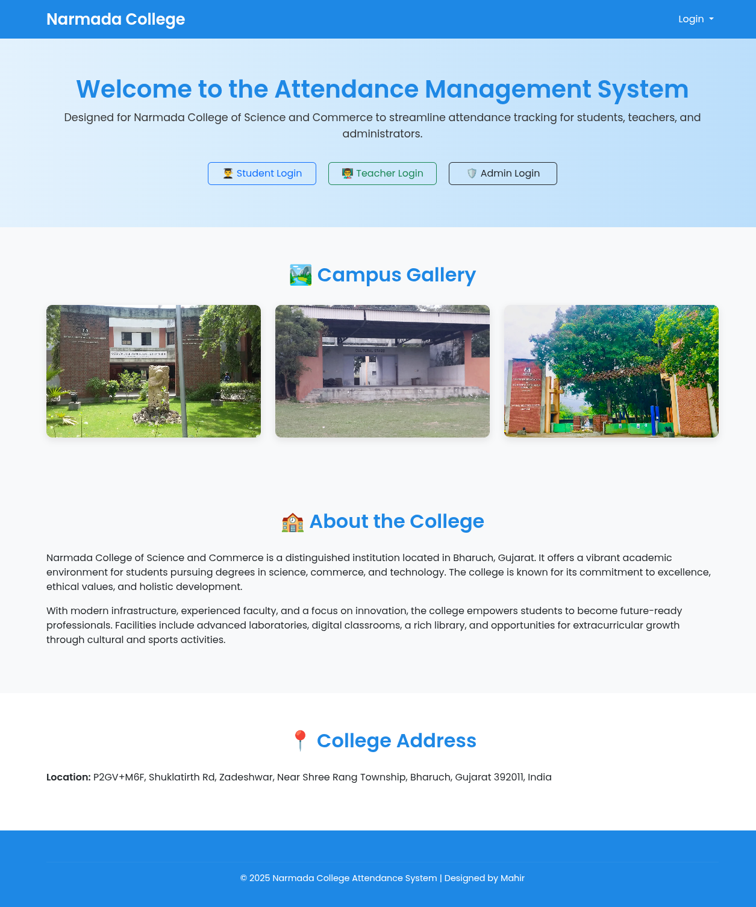
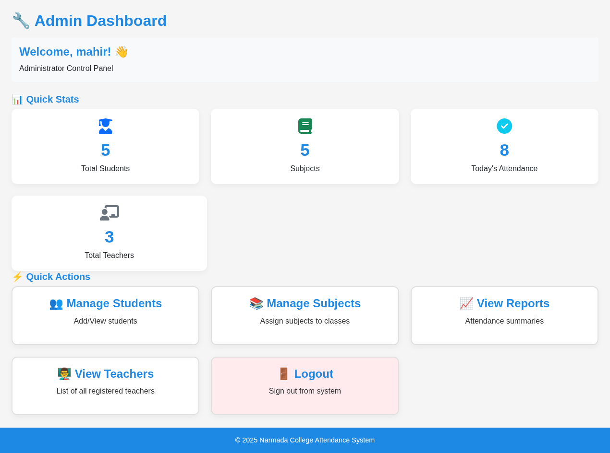
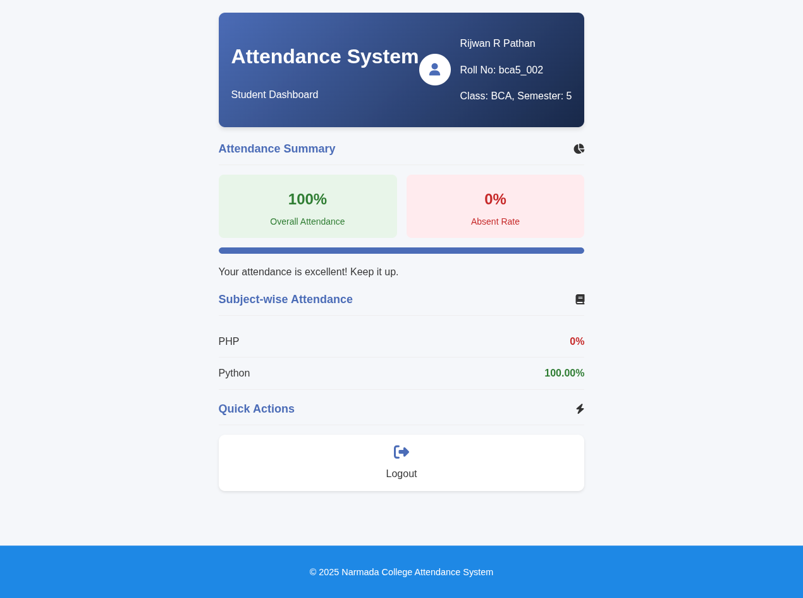
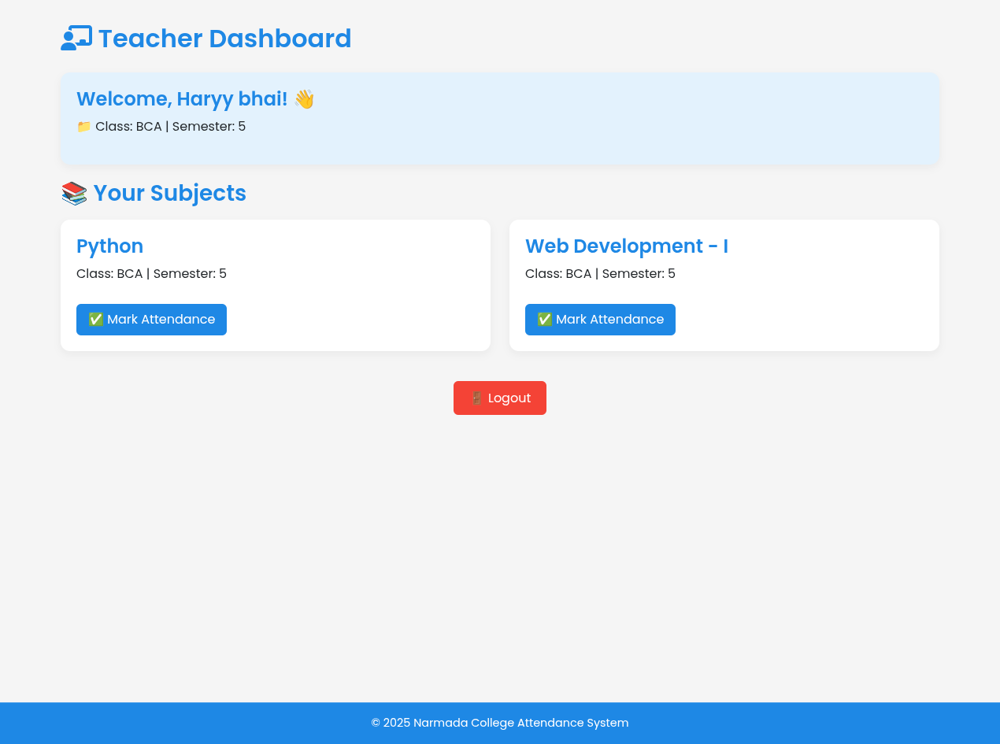
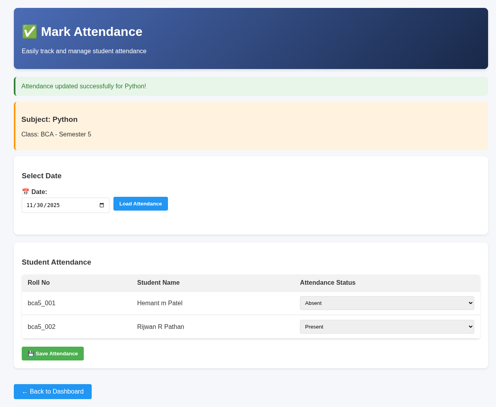
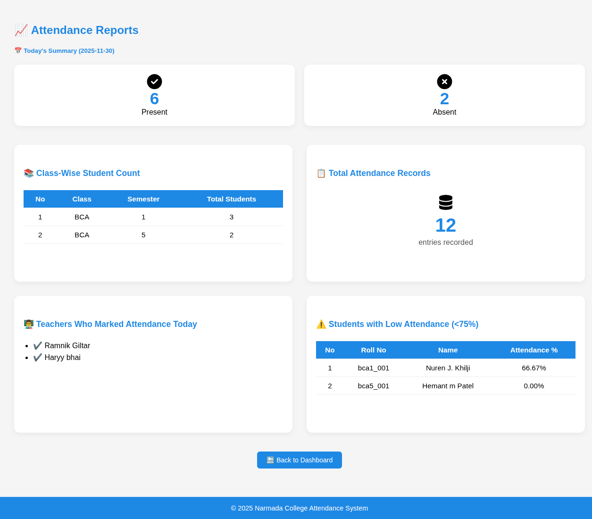
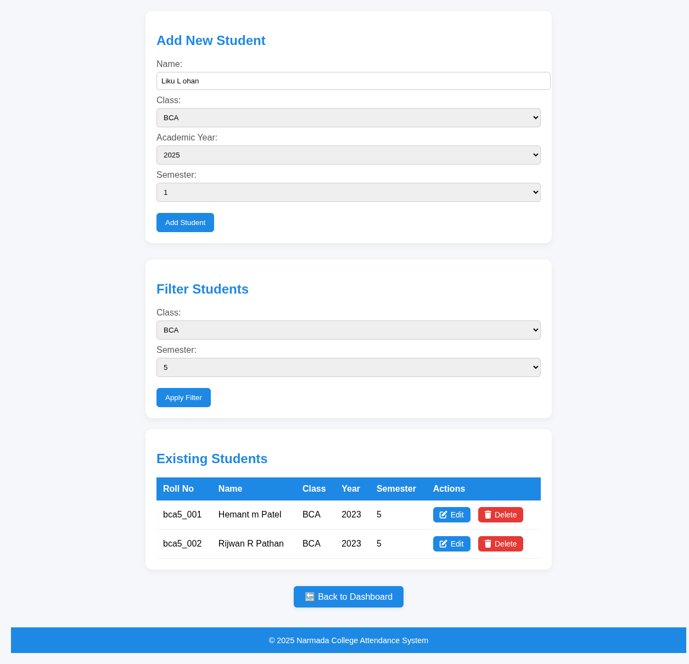

# 📊 Attendance Management System

A professional and efficient web-based **Attendance Management System** built to simplify attendance tracking for educational institutions. This project features a clean PHP-based backend and a responsive frontend, providing seamless interaction for Admins, Teachers, and Students.

---

## 🚀 Overview

This system digitizes the manual attendance process, reducing errors and providing instant access to attendance data. It is structured with three distinct portals, each tailored to specific user needs.

## 📸 Screenshots

### Home Page


### Dashboards & Portals
| Admin Dashboard | Student Dashboard | Teacher Dashboard |
|---|---|---|
|  |  |  |

### Key Features
| Mark Attendance | View Reports | Manage Students |
|---|---|---|
|  |  |  |

---

## ✨ Core Features (Verified)

### 👤 Multi-User Portals
- **Admin Dashboard**: Centralized control to manage students, teachers, classes, and subjects. Includes live monitoring of system usage.
- **Teacher Portal**: Simplified interface for teachers to mark daily attendance for their respective classes and subjects.
- **Student Portal**: Secure login for students to track their overall attendance percentage and subject-specific performance.

### 📈 System Capabilities
- **Real-time Stats**: View daily attendance summaries (Present/Absent/Late counts) instantly.
- **Student Analytics**: Identify students with low attendance (below 75%) automatically.
- **Class Management**: Manage student enrollment and subject assignments across different semesters.
- **Live Monitoring**: Track which teachers have marked attendance for the current day.

---

## 🛠️ Tech Stack

- **Backend**: PHP (MySQLi)
- **Database**: MySQL
- **Frontend**: HTML5, CSS3, JavaScript, **Bootstrap 5**, FontAwesome
- **Environment**: XAMPP / WAMP / LAMP

---

## 🏁 Getting Started

### Prerequisites
- **Local Server**: XAMPP (recommended)
- **Database**: phpMyAdmin

### Installation & Setup
1.  **Clone the Repo**:
    ```bash
    git clone https://github.com/mahirxpathan/Attendance-Management-System.git
    ```
2.  **Database Setup**:
    - Open **phpMyAdmin** and create a database named `attendance_db`.
    - Import the `attendance_db.sql` file located in the root folder.
3.  **Connection Settings**:
    - Open `attendance_system/includes/database.php`.
    - Verify your MySQL credentials (default is `root` with no password).
4.  **Run**:
    - Project can be accessed at `http://localhost/attendance_system`.

---

## 🔑 Access Credentials

> [!NOTE]  
> The credentials below are for the **Admin account**. Other roles (Teacher/Student) can be managed and created via the Admin panel.

| Role | Username | Password |
| :--- | :--- | :--- |
| **Admin** | `mahir` | `maru143` |

---

## 📝 License

Distributed under the MIT License. See `LICENSE` for more information.

---

## 👨‍💻 Developed By

**Mahir Pathan** - [GitHub](https://github.com/mahirxpathan)

*Project Link: [https://github.com/mahirxpathan/Attendance-Management-System](https://github.com/mahirxpathan/Attendance-Management-System)*


